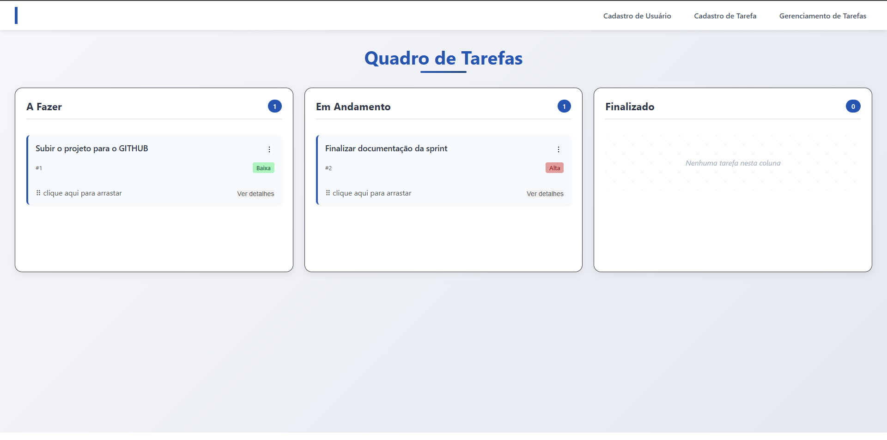

# 🧩 Kanban Frontend

Interface moderna e responsiva para gerenciamento de tarefas em estilo Kanban. Este projeto foi desenvolvido com **React + Vite**, e se comunica com um backend em FastAPI disponível [aqui](https://github.com/gabriela70707/Kanban-BackEnd.git).

## 📸 Demonstração




## 🚀 Tecnologias Utilizadas

- [React](https://reactjs.org/)
- [Vite](https://vitejs.dev/)
- [React Router](https://reactrouter.com/)
- [@dnd-kit/core](https://docs.dndkit.com/) – Drag and drop acessível
- [ARIA](https://developer.mozilla.org/en-US/docs/Web/Accessibility/ARIA) – Princípios de acessibilidade
- [SCSS] – Estilização das páginas


## ♿ Acessibilidade

Este projeto segue boas práticas de acessibilidade:

- Navegação por teclado (`Tab`, `Enter`, `Espaço`)
- Uso de atributos ARIA (`aria-label`, `aria-expanded`, `role`)
- Componentes interativos com foco e semântica correta

## 🛠️ Como Rodar Localmente

```bash
# Clone o repositório
git clone https://github.com/gabriela70707/Kanbam-Estilizado-Com-SCSS.git

# Acesse a pasta
cd Kanbam-Estilizado-Com-SCSS

# Instale as dependências
npm install

# Inicie o servidor de desenvolvimento
npm run dev

O app estará disponível em http://localhost:5173.

```

## 📄 Licença

Este projeto está sob a licença MIT. Veja o arquivo LICENSE para mais detalhes.


- Obrigada pela visita ✨

